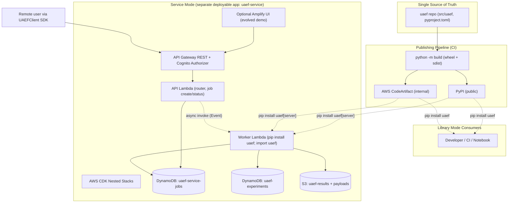
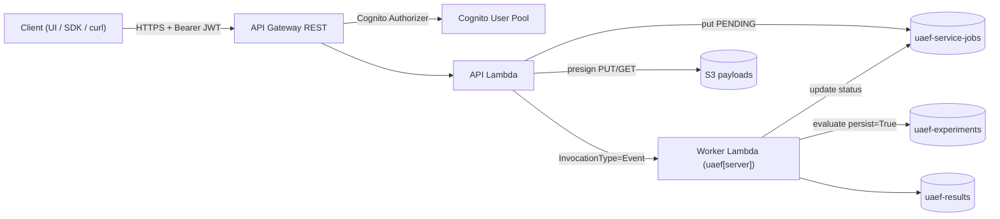
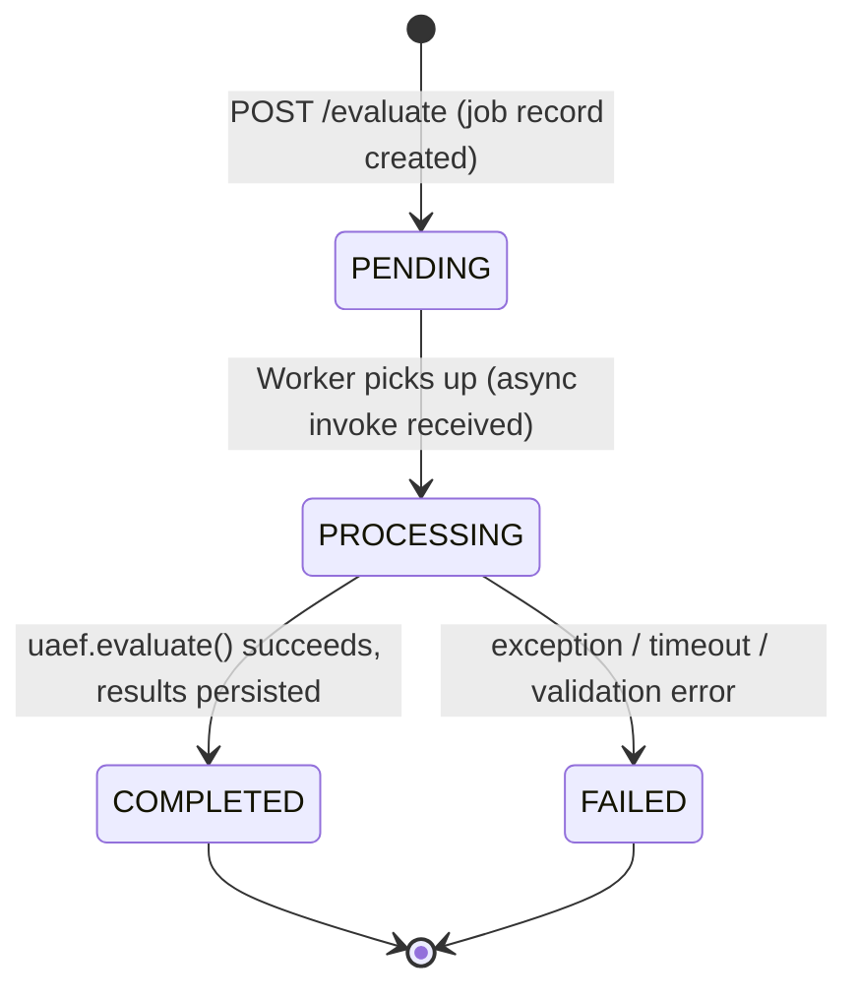

# Design Document: UAEF Dual Delivery

## Overview

UAEF today is consumed by cloning the repository or referencing a local wheel file. This design enables UAEF to be consumed two ways from a **single source of truth** without anyone copying or cloning the repo:

1. **Library mode** — the `uaef` package is built into a wheel and published to a registry (PyPI for public distribution, AWS CodeArtifact for internal). Users run `pip install uaef` (plus optional extras). The "clone the repo" and "reference a local `.whl`" friction is eliminated.
2. **Service mode** — a separate, deployable application (cloned and deployed by operators, never imported) exposes UAEF over HTTP via API Gateway + Cognito + Lambda. The service is **just another consumer** of the published `uaef` package: its Lambda handlers `pip install uaef` from the registry and `import uaef`. It does **not** vendor, copy, or re-implement UAEF source.

The service borrows architectural *ideas* (not code) from the `prod_agent_monitoring` reference app: AWS CDK nested stacks, API Gateway (REST) fronted by Cognito, and an async job + polling pattern that sidesteps API Gateway's hard 29-second integration timeout. A POST endpoint creates a DynamoDB job record (`PENDING`), triggers the long-running evaluation asynchronously, and returns a `jobId` immediately; the client polls a GET status endpoint (~10s interval) until `COMPLETED`/`FAILED`. Results persist to DynamoDB + S3, which maps directly onto UAEF's existing experiment persistence model.

A key product decision shapes the dependency structure: `pip install uaef` installs the **full capability set by default** so users can exercise every metric and use every capability out of the box. The required core therefore includes all runtime capability dependencies (pydantic, boto3, pyyaml, jsonpath-ng, numpy, deepeval, ragas, langchain-community, datasets, langchain-core, langchain-aws, langgraph, pandas, scikit-learn, openpyxl, requests). The former capability extras (`integrations`, `langgraph`, `analysis`, `judge`, `client`, `server`) are retained only as **no-op compatibility aliases** so existing install commands and the service Worker's pinned `uaef[server]==0.2.0` keep resolving; only developer tooling (`dev`) and the optional Jupyter kernel (`notebooks`) remain real opt-in extras. Because the full-capability install exceeds Lambda's 250MB unzipped limit, the service Worker Lambda defaults to **container-image packaging** (10GB image limit), with a zip-asset path retained as an opt-out.

This document contains both a **High-Level Design** (system diagrams, components, data models, deployment topology, the publish/distribution flow) and a **Low-Level Design** (service handler and client SDK signatures, the `pyproject.toml`, the async job state machine, and API route/request/response schemas).

### Goals

- Eliminate repo cloning / local-wheel friction; `pip install uaef` from a registry is the only install path.
- Keep one source of truth: the service depends on the published library as a normal pinned dependency.
- Ship the full capability set in the required core so `pip install uaef` lets users test every metric and use every capability out of the box; retain the former capability extras as no-op aliases for backward-compatible install commands.
- Provide an HTTP service that mirrors UAEF's `evaluate` / `batch_evaluate` / experiments API using an async job + polling lifecycle.
- Offer an optional `UAEFClient` SDK so remote users get library-like `evaluate()` ergonomics, hiding POST+poll mechanics.
- Enforce a strict no-duplication boundary: presentation layers (UI and service) contain no evaluation, aggregation, comparison, or metric-catalog logic of their own — they only call `uaef`.

### Non-Goals

- Re-implementing evaluation logic in the service (the service calls into `uaef`).
- Supporting in-process user Python (custom metrics via `register_metric`, `GenericJSONAdapter` schema mappings) in service mode. This is a documented limitation, not something to engineer around.
- Replacing the existing demo React + FastAPI app; the optional Amplify UI is an evolution of it.

---

## High-Level Design

## Architecture

### Single Source of Truth, Two Delivery Channels



The critical relationship: **both** the developer's machine and the service Worker Lambda obtain `uaef` the *same way* — from the registry. The service has no copy of UAEF source.

## Components and Interfaces

| Component | Lives in | Responsibility |
|-----------|----------|----------------|
| `uaef` package | `uaef` repo (this project) | The library. Published as a wheel. Unchanged public API (`evaluate`, `batch_evaluate`, adapters, experiments). |
| Publishing pipeline | `uaef` repo CI (`gitlab-ci.yml` / GH Actions) | Build wheel + sdist, version bump, publish to PyPI and/or CodeArtifact. |
| `uaef.client` | `uaef` repo (new, library extra) | Optional `UAEFClient` SDK: HTTP wrapper that mirrors `evaluate()` and hides POST+poll. Shipped *with* the library so library users can talk to a remote service. |
| `uaef-service` app | Separate deployable repo/app | CDK infra + Lambda handlers. Consumes `uaef` from the registry. Never imports source. |
| API Lambda | `uaef-service` | Validates request, creates job record, async-invokes worker, serves status/results. |
| Worker Lambda | `uaef-service` | `import uaef`; runs `evaluate`/`batch_evaluate`; updates job; persists to UAEF experiment store. |
| Jobs table | `uaef-service` (DynamoDB) | Async job lifecycle state. |
| Experiments + results | UAEF persistence (DynamoDB + S3) | Reused as-is — service writes through `uaef` persistence. |
| Optional Amplify UI | `uaef-service` (evolved from `demo/`) | Browser client over the same API. Refactored to remove duplicated comparison/aggregation/metric-catalog logic (calls `uaef` instead). |

## Data Models

### Data Models (High-Level)

**Job record (new — `uaef-service-jobs` DynamoDB table):**

| Field | Type | Notes |
|-------|------|-------|
| `jobId` (PK) | String (UUID) | Returned to client on POST. |
| `status` | String | `PENDING` → `PROCESSING` → `COMPLETED` \| `FAILED`. |
| `operation` | String | `evaluate` \| `batch_evaluate`. |
| `requestRef` | String | S3 key of the stored request payload (for large/batch input). |
| `experimentId` | String | UAEF experiment id, populated on completion when persisted. |
| `resultRef` | String | S3 key of the result payload (large results offloaded to S3). |
| `resultSummary` | Map | Small inline summary (overall score, pass/fail, counts). |
| `error` | Map | `{code, message}` on `FAILED`. |
| `createdBy` | String | Cognito `sub` of the caller. |
| `createdAt` / `updatedAt` | String (ISO8601) | Timestamps. |
| `ttl` | Number | Epoch seconds for DynamoDB TTL auto-expiry of job records. |

**Experiment + results (reused, unchanged):** the existing UAEF model — one DynamoDB row per experiment (`experiment_id` PK, `average_scores`, `result_path`, …) and the full `EvaluationResult` JSON in S3. The service writes these by calling `uaef` with `persist=True`, so there is no schema divergence.

### Deployment Topology



CDK organizes this as nested stacks under a parent (mirroring the reference app's structure):

| Stack | Purpose |
|-------|---------|
| Parent (`UaefServiceStack`) | Orchestrates nested stacks, wires shared config. |
| `AuthStack` | Cognito User Pool + app client. |
| `ApiStack` | API Gateway REST, Cognito authorizer, API Lambda, routes, throttling, access logs. |
| `WorkerStack` | Worker Lambda packaged as a **container image by default** (the full-capability `uaef` exceeds the 250MB unzipped zip limit); `-c worker_container_image=false` opts back into zip-asset packaging. Async invoke permissions, IAM for Bedrock + DynamoDB + S3. |
| `StorageStack` | Jobs DynamoDB table (+ TTL), payload S3 bucket. UAEF experiment table/bucket referenced or created here. |
| `UiStack` (optional) | Amplify hosting for the evolved demo UI. |

### Distribution Flow (Publish + Consume)

This is the heart of removing the "copy the repo" friction.

```mermaid
sequenceDiagram
    participant Dev as Maintainer
    participant CI as CI Pipeline
    participant Reg as Registry (PyPI / CodeArtifact)
    participant User as Library User
    participant LWorker as Service Worker Lambda (build step)

    Dev->>CI: tag release vX.Y.Z (or merge to main)
    CI->>CI: python -m build  (wheel + sdist)
    CI->>CI: twine check dist/*
    CI->>Reg: twine upload (publish vX.Y.Z)
    User->>Reg: pip install uaef==X.Y.Z
    Reg-->>User: wheel (full capability set)
    LWorker->>Reg: pip install "uaef[server]==X.Y.Z" -t ./package
    Reg-->>LWorker: wheel (full core; server is a no-op alias) — packaged as a container image
```

**Versioning:** Semantic versioning. The single `version` in `pyproject.toml` is the source of truth. The service pins an exact version (`uaef[server]==X.Y.Z`) so deploys are reproducible. CI rejects publishing a version that already exists in the registry.

**How pip consumes it:**
- Public: `pip install uaef` resolves from PyPI directly.
- Internal: developers/CI configure CodeArtifact as the index once:
  ```bash
  aws codeartifact login --tool pip --domain <domain> --repository <repo>
  pip install uaef            # full capability set (all metrics out of the box)
  pip install "uaef[integrations]"   # no-op alias — resolves to the same full core
  ```
- The README's "Option 1: clone the repo" and "Option 2: local wheel file" instructions are **replaced** by a single registry install section.

### Dependency Strategy (High-Level Rationale)

The product's central intent is that users can test **every** metric and use **every** capability immediately after `pip install uaef`. To serve that, all runtime capabilities ship in the required core rather than behind opt-in extras:

- **Core (always installed) — the full capability set:** `pydantic`, `boto3`, `pyyaml`, `jsonpath-ng`, `numpy` (canonical models, config, GenericJSON adapter, AWS persistence) plus all heavy capability backends: `deepeval`, `ragas`, `langchain-community`, `datasets` (third-party metrics), `langchain-core`, `langchain-aws`, `langgraph` (LangGraph/LangChain adapter), `pandas`, `scikit-learn`, `openpyxl` (analysis & reporting), and `requests` (client SDK). Nothing capability-related is gated behind an extra.
- **Capability extras (retained as no-op aliases):** `integrations`, `langgraph`, `analysis`, `judge`, `client`, and `server` are now **empty lists**. They exist only so existing install commands (e.g. `pip install "uaef[integrations]"`) and the service Worker's pinned `uaef[server]==0.2.0` continue to resolve. Because every capability is already in core, these add nothing.
- **Real opt-in extras (tooling only):** `notebooks` (`ipykernel`) for the Jupyter kernel and `dev` (pytest, black, mypy, ruff, build, twine) for development tooling. `all` is retained for compatibility and additionally pulls the optional Jupyter kernel (`all = ["uaef[notebooks]"]`).

Why it matters for both modes:
- **Library experience:** every user gets all metrics and capabilities out of the box — no guessing which extra unlocks a metric, no `ImportError` surprises when trying a new backend.
- **Lambda 250MB limit:** because the full core pulls all heavy backends, the Worker's install exceeds the 250MB unzipped zip limit. The Worker Lambda therefore **defaults to a container image** (10GB image limit), with a zip-asset path as an explicit opt-out — see the WorkerStack table and Error Handling / Performance.

Code-level extras structure is in the Low-Level Design.

### Optional Service Client SDK (High-Level)

`uaef.client.UAEFClient` ships with the library (behind a light `client` extra: just `requests`). It gives remote users the same ergonomics as local `evaluate()`:

```python
from uaef.client import UAEFClient

client = UAEFClient(endpoint="https://api.example.com", token=cognito_jwt)
result = client.evaluate(trace=trace, ground_truth=gt, persist=True,
                         experiment_name="remote-run")
```

Internally `client.evaluate()` does POST `/evaluate` → receive `jobId` → poll `/jobs/{jobId}` every ~10s until terminal → fetch result. The blocking POST+poll loop is hidden behind a synchronous call that returns an `EvaluationResult`-shaped object.

### Known Limitation (documented honestly)

`register_metric` (custom metrics) and `GenericJSONAdapter` schema mappings execute **user-supplied Python in-process**. These are library-mode features. In service mode the worker runs trusted, curated server-side metrics only; arbitrary user code is not accepted (security + packaging). Service users get the curated built-in/integration metric set. Users who need custom metrics or custom schema mappings use **library mode**. This trade is documented rather than engineered around (no plugin sandbox, no remote code execution path).

### No-Duplication Boundary (UI / Service vs. Library)

A core architectural rule: **all evaluation, aggregation, comparison, and metric-catalog logic lives in `uaef` and only there.** Presentation layers (the demo/Amplify UI backend and the service Lambdas) are thin — they marshal input, call library functions, and shape output for transport. They must not re-implement library behavior.

This rule is not just forward-looking. An audit of the existing demo backend (`demo/backend/main.py`) found logic that duplicates the library and must be refactored to call into `uaef` instead:

| Duplicated in UI backend | Library owner (call this instead) | Action |
|--------------------------|-----------------------------------|--------|
| `compare_experiments` route — builds its own comparison table, min/max/spread, and insight strings | `uaef.experiments.comparison.ComparisonEngine` (`compare_runs`, `compare_multiple_runs`, `get_comparison_summary`); also `uaef.api.compare_runs` | Replace hand-rolled comparison with `ComparisonEngine`. |
| `run_evaluation` and `get_experiment_results` — recompute `metric_totals`, `average_scores`, `overall_avg` from raw rows | Persistence layer already computes/stores `average_scores` + `overall_average_score` per experiment (recomputed on every write) | Read stored aggregates; do not recompute. |
| `get_metrics` — hardcodes RAGAS / DeepEval / Stickler metric name lists inline | `uaef.integrations.registry` (integration metric names) + `list_metrics_by_dimension()` (built-ins) | Expose one library "full metric catalog" function the UI/service call; remove hardcoded lists. |
| Agent invocation helpers (`_invoke_bedrock_agent`, `_invoke_http_agent`, `_invoke_langfuse_trace`, `_invoke_http_agent_for_framework`) live only in the UI | Today only `AgentCoreAdapter.invoke` is in the library; the rest are UI-only glue | Promote invocation glue into the library (e.g. an invocation helper alongside the adapters) so the service does not re-create it — otherwise this becomes a UI-vs-service duplicate. |

To support this boundary cleanly, the library exposes (or already exposes) the canonical entry points the presentation layers consume:

- `uaef.api.evaluate` / `batch_evaluate` — scoring.
- Stored experiment aggregates via the persistence layer — never recomputed by callers.
- `uaef.api.compare_runs` / `ComparisonEngine` — comparison + insights.
- A single **full metric catalog** function (new, small): built-ins from the metric registry + integration metrics from the integrations registry, so neither the UI nor the service hardcodes metric names.
- Agent-invocation helpers (promoted from the demo backend) so both UI and service invoke live agents through the same library code path.

The service Worker Lambda and the optional Amplify UI both sit *above* these entry points and add no parallel implementations. This keeps the service genuinely "just another consumer" of the library (Property 1) and prevents the comparison/aggregation/catalog logic from forking into three copies (library, UI, service).

---

## Low-Level Design

> Language: Python (the package and service handlers are Python). All code below is illustrative of signatures and structure.

### `pyproject.toml` (full-capability core + compatibility aliases)

`pip install uaef` installs the full capability set. The capability extras are retained as empty-list aliases so existing install commands and the pinned `uaef[server]==0.2.0` keep resolving; only `notebooks` and `dev` are real opt-in extras.

```toml
[build-system]
requires = ["setuptools>=68.0.0", "wheel"]
build-backend = "setuptools.build_meta"

[project]
name = "uaef"
version = "0.2.0"
requires-python = ">=3.10"
# Full capability core — `pip install uaef` installs everything needed to
# exercise every metric, adapter, analysis, judge, and the remote client SDK.
# UAEF's purpose is letting users test all metrics out of the box, so all
# runtime capabilities ship in the required core rather than behind extras.
# (Only developer tooling and the optional Jupyter kernel remain opt-in.)
dependencies = [
    # Canonical models, config, GenericJSON adapter, AWS persistence.
    "pydantic>=2.0.0",
    "boto3>=1.28.0",
    "pyyaml>=6.0",
    "jsonpath-ng>=1.6.0",
    "numpy>=1.24.0",
    # Third-party metric backends (RAGAS / DeepEval).
    "deepeval>=1.0.0",
    "ragas>=0.1.0,<0.5.0",
    "langchain-community>=0.3.0,<0.4.0",
    "datasets>=2.14.0",
    # LangGraph / LangChain adapter support.
    "langchain-core>=1.3.2",
    "langchain-aws>=1.4.5",
    "langgraph>=1.1.10",
    # Tabular analysis & reporting (root cause, clustering, trends).
    "pandas>=2.0.0",
    "scikit-learn>=1.3.0",
    "openpyxl>=3.1.5",
    # Remote client SDK (UAEFClient).
    "requests>=2.31.0",
]

[project.optional-dependencies]
# The capability extras below are retained as no-op aliases of the full core
# so existing install commands (e.g. `pip install "uaef[integrations]"`) and
# the service Worker's pinned `uaef[server]==0.2.0` keep resolving. Every
# capability is already in the required core, so these add nothing.
integrations = []
langgraph = []
analysis = []
judge = []
client = []
# What the service Worker Lambda installs. Now identical to the full core;
# because the core pulls all heavy backends, the Worker exceeds the 250MB
# unzipped zip limit and is packaged as a container image (see WorkerStack).
server = []
notebooks = ["ipykernel>=6.31.0"]
dev = [
    "pytest>=7.0.0",
    "pytest-asyncio>=0.21.0",
    "black>=23.0.0",
    "mypy>=1.0.0",
    "ruff>=0.1.0",
    "build>=1.0.0",
    "twine>=5.0.0",
]
# Retained for compatibility. The core already includes every capability;
# `all` additionally pulls the optional Jupyter kernel.
all = ["uaef[notebooks]"]

[tool.setuptools.packages.find]
where = ["src"]
```

**Graceful import guards (now inert, kept as defensive safety).** The `ImportError` guards around integration backends still exist in code, but since every capability backend now ships in the required core, these imports always succeed. They are retained as defensive safety only:

```python
# src/uaef/integrations/ragas_connector.py
try:
    import ragas  # noqa: F401
except ImportError as exc:  # pragma: no cover  (inert: ragas ships in core)
    raise ImportError(
        "RAGAS metrics require the 'integrations' extra. "
        "Install with: pip install 'uaef[integrations]'"
    ) from exc
```

**New library entry point — full metric catalog.** To stop the UI/service from hardcoding integration metric names, the library exposes one canonical catalog function that merges the built-in registry with the integrations registry:

```python
# src/uaef/metrics/__init__.py  (or uaef/api)
def get_full_metric_catalog() -> dict[str, list[str]]:
    """Return every available metric name grouped by dimension/integration:
    built-ins from the metric registry + RAGAS/DeepEval/Stickler from the
    integrations registry. Single source of truth for UI and service catalogs.
    All capability backends ship in the core, so every integration group is
    always available."""
```

### Distribution / Publishing (CI steps)

```bash
# Build (single source of truth -> artifacts)
python -m build                      # produces dist/uaef-X.Y.Z-py3-none-any.whl + .tar.gz
twine check dist/*                   # metadata/readme validation

# Publish — public
twine upload dist/*                  # to PyPI (token via CI secret)

# Publish — internal (CodeArtifact)
aws codeartifact login --tool twine --domain <domain> --repository <repo>
twine upload --repository codeartifact dist/*
```

```yaml
# gitlab-ci.yml (publish stage sketch)
publish:
  stage: publish
  rules:
    - if: '$CI_COMMIT_TAG =~ /^v\d+\.\d+\.\d+$/'   # only on version tags
  script:
    - pip install build twine
    - python -m build
    - twine check dist/*
    - twine upload dist/*            # PyPI or CodeArtifact per env vars
```

### Async Job State Machine



State transition rules:
- `PENDING` set by API Lambda before async invoke. If async invoke fails to enqueue, job is set `FAILED` synchronously.
- `PROCESSING` set by Worker as its first action (idempotent guard: only transition from `PENDING`).
- `COMPLETED` written atomically with `experimentId`, `resultRef`/`resultSummary`.
- `FAILED` written with `error.code` + `error.message`; never overwrites a `COMPLETED` record.
- Terminal states are immutable. A Worker retry that finds a terminal job exits without rewriting.

### API Route Definitions

All routes are behind API Gateway REST with a Cognito authorizer. Routes map onto UAEF's `evaluate` / `batch_evaluate` / experiments API.

| Method | Path | Maps to | Sync/Async |
|--------|------|---------|------------|
| POST | `/evaluate` | `uaef.api.evaluate` | Async (returns `jobId`) |
| POST | `/batch-evaluate` | `uaef.api.batch_evaluate` | Async (returns `jobId`) |
| GET | `/jobs/{jobId}` | job status + result ref | Sync (polled ~10s) |
| GET | `/experiments` | list experiments (UAEF store) | Sync |
| GET | `/experiments/{experimentId}` | experiment detail + result S3 link | Sync |
| POST | `/payloads` | request a presigned S3 PUT URL for large/batch payloads | Sync |
| GET | `/metrics` | curated server-side metric catalog | Sync |

**Payload handling.** API Gateway caps request bodies at 10MB. For large batch trace payloads the client first calls `POST /payloads` to get a presigned S3 URL, uploads the payload to S3, then references it by key in the POST body (`tracesRef`). Small payloads may be sent inline.

### Request/Response Schemas

```python
# ---- POST /evaluate (request) ----
class EvaluateRequest(BaseModel):
    trace: dict | None = None             # inline canonical/raw trace
    traceRef: str | None = None           # OR S3 key for large inline trace
    ground_truth: dict | None = None
    adapter: str | None = None
    metrics: list[str] | None = None      # curated server-side names only
    context: list[str] | None = None
    persist: bool = False
    experiment_name: str | None = None
    experiment_objective: str | None = None
    # custom metrics / GenericJSON schema mappings are NOT accepted server-side

# ---- POST /batch-evaluate (request) ----
class BatchEvaluateRequest(BaseModel):
    traces: list[dict] | None = None
    tracesRef: str | None = None          # S3 key (preferred for large batches)
    ground_truths: list[dict] | None = None
    adapter: str | None = None
    metrics: list[str] | None = None
    max_workers: int = 4
    persist: bool = False
    experiment_name: str | None = None
    experiment_objective: str | None = None

# ---- POST /evaluate | /batch-evaluate (response) ----
class JobCreatedResponse(BaseModel):
    jobId: str
    status: str = "PENDING"
    message: str = "Job started. Poll GET /jobs/{jobId} for results."

# ---- GET /jobs/{jobId} (response) ----
class JobStatusResponse(BaseModel):
    jobId: str
    status: str                            # PENDING|PROCESSING|COMPLETED|FAILED
    operation: str                         # evaluate|batch_evaluate
    experimentId: str | None = None
    resultSummary: dict | None = None      # small inline summary
    resultRef: str | None = None           # S3 key / presigned GET for full result
    error: dict | None = None              # {code, message} when FAILED
    createdAt: str
    updatedAt: str

# ---- POST /payloads (response) ----
class PresignResponse(BaseModel):
    uploadUrl: str                         # presigned S3 PUT
    key: str                               # reference to pass back as traceRef/tracesRef
    expiresIn: int = 900
```

### Service Handler Signatures

```python
# uaef-service/handlers/api.py  (API Lambda — router; does NOT import uaef)
def handler(event: dict, context) -> dict:
    """API Gateway proxy entry. Routes by (httpMethod, resource)."""

def create_evaluate_job(event: dict, operation: str) -> dict:
    """
    Validate EvaluateRequest/BatchEvaluateRequest, write PENDING job to DynamoDB,
    async-invoke the worker (InvocationType='Event'), return JobCreatedResponse.
    operation in {"evaluate", "batch_evaluate"}.
    """

def get_job_status(job_id: str, caller_sub: str) -> dict:
    """Read job from DynamoDB; authorize by createdBy; return JobStatusResponse.
    Adds a presigned GET URL for resultRef when COMPLETED."""

def list_experiments(query: dict) -> dict: ...
def get_experiment(experiment_id: str) -> dict: ...
def presign_payload_upload(caller_sub: str) -> dict:
    """Return a presigned S3 PUT URL + key for large/batch payload upload."""
def get_metric_catalog() -> dict:
    """Return the curated server-side metric names (no custom metrics).
    Delegates to the library's full metric-catalog function — built-ins from
    the metric registry + integration metrics from the integrations registry.
    Does NOT hardcode metric name lists."""
```

```python
# uaef-service/handlers/worker.py  (Worker Lambda — imports the published package)
import uaef
from uaef.api import evaluate, batch_evaluate   # from pip-installed uaef[server]

def handler(event: dict, context) -> None:
    """
    Async-invoked with {action, jobId, operation, requestRef|request}.
    1. Transition job PENDING -> PROCESSING (idempotent).
    2. Load request (inline or from S3 via requestRef).
    3. Call evaluate()/batch_evaluate() with persist as requested.
    4. On success: write COMPLETED (+ experimentId, resultRef/resultSummary).
       On failure: write FAILED (+ error).
    """

def _run_evaluate(req: dict) -> "EvaluationResult": ...
def _run_batch_evaluate(req: dict) -> list: ...
def _store_result(job_id: str, result) -> str:
    """Persist full result JSON to S3, return resultRef key."""
def _transition(job_id: str, frm: str, to: str, **attrs) -> bool:
    """Conditional DynamoDB update; returns False if not in expected 'frm' state."""
```

### Optional Client SDK Signatures

```python
# src/uaef/client/__init__.py  (ships with the library, 'client' extra)
class UAEFClient:
    def __init__(self, endpoint: str, token: str,
                 poll_interval: float = 10.0, timeout: float = 1800.0): ...

    def evaluate(self, trace, ground_truth=None, adapter=None,
                 metrics=None, context=None, persist=False,
                 experiment_name=None, experiment_objective=None) -> "EvaluationResult":
        """POST /evaluate, then poll /jobs/{jobId} until terminal; return result.
        Mirrors uaef.api.evaluate so remote users get the same ergonomics."""

    def batch_evaluate(self, traces, ground_truths=None, adapter=None,
                       metrics=None, max_workers=4, persist=False,
                       experiment_name=None, experiment_objective=None) -> list:
        """POST /batch-evaluate, upload large payloads via /payloads, then poll."""

    def get_job(self, job_id: str) -> "JobStatusResponse": ...
    def list_experiments(self) -> list: ...
    def get_experiment(self, experiment_id: str) -> dict: ...

    def _submit(self, path: str, body: dict) -> str:
        """POST, auto-offload oversized payloads to presigned S3, return jobId."""
    def _poll(self, job_id: str) -> "JobStatusResponse":
        """Poll every poll_interval until COMPLETED/FAILED or timeout; raise on FAILED."""
```

### Worker Invocation Strategy (tradeoffs)

| Option | Pros | Cons | Decision |
|--------|------|------|----------|
| **Self-invoke** (API Lambda `InvocationType='Event'` re-invokes its own function with an `action` flag, as in the reference app) | Simplest; one function; no extra infra | Couples API and compute; one cold-start profile; 15-min Lambda cap | Viable for small/medium loads |
| **Dedicated Worker Lambda** (separate function for compute) | Clean separation; independent memory/timeout/concurrency; API stays lean | Two functions to package/deploy | **Recommended default** — isolates heavy `uaef[server]` deps from the API Lambda |
| **Step Functions** (orchestrate long/batch jobs) | Handles >15min, retries, fan-out for big batches | More infra + cost; overkill for single evals | Use when batches exceed Lambda's 15-min limit |

Recommendation: **dedicated Worker Lambda** as the default, with Step Functions as a documented escalation path for very large batch jobs. The API Lambda keeps only lightweight deps (boto3); the Worker carries the full-capability `uaef` package. Because that full install exceeds the 250MB unzipped zip limit, the Worker is packaged as a **container image by default** (10GB image limit), with `-c worker_container_image=false` as a zip-asset opt-out.

### Example Usage

```python
# Library mode (unchanged ergonomics, now installed from registry)
# $ pip install uaef          # full capability set — every metric available
from uaef.api import evaluate
result = evaluate(trace=trace, ground_truth=gt, persist=True,
                  experiment_name="local-run")

# Service mode via SDK (hides POST + poll)
# $ pip install uaef          # client SDK ships in the full core
from uaef.client import UAEFClient
client = UAEFClient(endpoint="https://api.example.com", token=jwt)
result = client.evaluate(trace=trace, ground_truth=gt, persist=True,
                         experiment_name="remote-run")
print(result.overall_score)

# Service mode raw HTTP
# POST /evaluate {trace, persist:true}  -> {"jobId":"...","status":"PENDING"}
# GET  /jobs/<jobId> (poll ~10s)        -> {"status":"COMPLETED","experimentId":"...","resultRef":"..."}
```

## Correctness Properties

These define expected behavior and inform later test design.

### Property 1: Single source of truth
The `uaef-service` app contains no copy of UAEF source; the Worker resolves `import uaef` only from the pip-installed registry package at the pinned version.

### Property 2: Full capability set in core; extras are compatibility aliases
`pip install uaef` installs every runtime capability, so any built-in or integration metric is importable and runnable out of the box without requesting an extra. The capability extras (`integrations`, `langgraph`, `analysis`, `judge`, `client`, `server`) resolve to empty no-op aliases of the full core, keeping existing install commands and the pinned `uaef[server]==0.2.0` valid. The ImportError guards remain in code as defensive safety but are inert because all capability imports succeed.

### Property 3: Job lifecycle monotonicity
A job's status only advances `PENDING → PROCESSING → {COMPLETED|FAILED}`; terminal states are never overwritten.

### Property 4: Async correctness
Every POST to `/evaluate` or `/batch-evaluate` returns within the API Gateway timeout with a `jobId`, regardless of evaluation duration (no synchronous evaluation on the request path).

### Property 5: Result equivalence
For the curated server-side metric set, a trace evaluated via the service yields the same `EvaluationResult` scores as the same trace evaluated via the library at the same version (the service adds no evaluation logic).

### Property 6: Persistence fidelity
Service-side `persist=True` writes the same DynamoDB experiment row + S3 result JSON shape as library-side persistence.

### Property 7: Authorization
Every protected route requires a valid Cognito JWT; a caller can only read jobs they created (`createdBy == sub`).

### Property 8: Payload bound respected
Requests exceeding the API Gateway 10MB body limit are handled via S3 reference, not rejected for size alone.

### Property 9: SDK parity
`UAEFClient.evaluate(...)` accepts the same core arguments as `uaef.api.evaluate(...)` and returns an equivalent result object.

### Property 10: Documented limitation holds
Custom metrics (`register_metric`) and `GenericJSONAdapter` schema mappings are rejected/ignored server-side; they remain available only in library mode.

### Property 11: No business-logic duplication
The UI and service compute evaluation, aggregation, comparison, and metric catalogs only by calling `uaef` functions (`evaluate`/`batch_evaluate`, stored `average_scores`/`overall_average_score`, `compare_runs`/`ComparisonEngine`, the full metric-catalog function). Presentation layers contain no independent re-implementations of this logic. The existing demo backend's hand-rolled comparison, aggregation, and hardcoded metric lists are refactored to satisfy this.

## Error Handling

| Scenario | Response | Recovery |
|----------|----------|----------|
| Missing integration extra at runtime | Not expected — every capability ships in core, so import guards are inert | N/A (capability imports always succeed). |
| Async invoke fails to enqueue | API sets job `FAILED` synchronously, returns 502 | Client re-submits. |
| Worker exception / timeout | Job `FAILED` with `error.code`/`message` | Client inspects error; re-submits or reduces batch. |
| Payload > 10MB sent inline | API returns 413 with guidance to use `/payloads` | Client uploads to S3, references key. |
| Full-capability `uaef` exceeds 250MB unzipped | Worker Lambda is packaged as a **container image by default** (10GB) | Default path; `-c worker_container_image=false` opts into zip-asset packaging when a slimmer build fits. |
| Custom metric requested server-side | 400 with explanation + link to library mode | Use library mode. |
| Unauthorized job read | 403 | N/A. |

## Testing Strategy

- **Unit:** request schema validation, job state transition guards (reject illegal transitions, terminal immutability), SDK POST+poll loop (mocked HTTP). The inert import guards may still be unit-tested for their message, but every capability backend is importable from core.
- **Property-based:** job state machine (random transition sequences never violate monotonicity/terminal immutability); SDK argument parity with `evaluate()`. Suggested library: `hypothesis`.
- **Integration:** publish to a test CodeArtifact repo → `pip install uaef` into a clean env → confirm every capability metric is importable and runnable → run Worker locally against DynamoDB Local + S3 (moto). End-to-end: POST → poll → COMPLETED with persisted experiment.
- **Packaging:** CI check that the Worker **container image builds** (the default, since the full-capability install exceeds the 250MB unzipped zip limit); if the zip-asset opt-out is used, assert the build stays under 250MB unzipped.
- **No-duplication (Property 11):** verify the refactored demo backend calls `ComparisonEngine`/`compare_runs` (no hand-rolled comparison), reads stored `average_scores`/`overall_average_score` (no recomputation), and sources metric names from the catalog function (no hardcoded RAGAS/DeepEval/Stickler lists). A lightweight guard test (or grep-based CI check) asserts the UI/service modules import these library entry points rather than reimplementing them.

## Security Considerations

- API Gateway protected by Cognito authorizer; JWT required on all routes; per-caller job isolation.
- No user-supplied Python executed server-side (custom metrics/schema mappings rejected) — eliminates RCE surface.
- Presigned S3 URLs are short-lived (≤15 min) and scoped to a single key.
- Bedrock/DynamoDB/S3 access via least-privilege IAM on the Worker role.
- Registry credentials (PyPI token / CodeArtifact auth) stored as CI secrets, never in source.

## Performance Considerations

- Async job pattern removes the 29s API Gateway integration timeout from the critical path.
- Worker memory sized for evaluation workloads (LLM-judge calls dominate latency, not CPU); timeout up to 15 min (Lambda) or Step Functions for longer.
- The full-capability core makes the Worker install large, so it ships as a container image (10GB limit) by default; the zip-asset opt-out is available when a build fits under 250MB unzipped. Container packaging adds some cold-start cost, accepted in exchange for shipping all capabilities.
- Batch evaluation parallelism via `max_workers` is bounded by Lambda memory/concurrency.

## Dependencies

- **Library:** full capability core — pydantic, boto3, pyyaml, jsonpath-ng, numpy, deepeval, ragas, langchain-community, datasets, langchain-core, langchain-aws, langgraph, pandas, scikit-learn, openpyxl, requests. Opt-in tooling extras: `notebooks` (ipykernel), `dev`.
- **Publishing:** `build`, `twine`; PyPI and/or AWS CodeArtifact.
- **Service:** AWS CDK, API Gateway, Lambda (Worker as a container image by default), DynamoDB, S3, Cognito; optional Amplify; the published `uaef` package (installed via the `uaef[server]` alias).
- **SDK:** `requests` (ships in the full core; `uaef[client]` resolves as a no-op alias).
