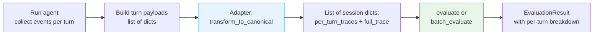

# Multi-Turn Evaluation Workflow

This is the **complete multi-turn evaluation workflow**, end to end: building per-turn
payloads while the agent runs, grouping them into sessions with the adapter, dispatching to
an evaluator, and reading the per-turn breakdown back out of the result.

!!! note "You only need this for multi-turn conversations"
    For a single-turn evaluation, none of the machinery below applies. Build one `AgentTrace`
    and pass it straight to `evaluate()` — no turn payloads, no `session_id`, no `turn_id`:

    ```python
    result = evaluate(trace=trace, ground_truth=ground_truth, metrics=[...])
    ```

    `session_id` is an optional field on `AgentTrace` (defaults to `None`) and `turn_id` is
    not an `AgentTrace` field at all — it exists only in the turn-payload format described
    below. See [Quickstart](../Getting-Started/quickstart.md) for the single-turn path.

The multi-turn path is uniform across single-agent and multi-agent conversations — the
adapter normalizes input shapes, and `evaluate()` / `batch_evaluate()` dispatch to the right
evaluator automatically.

## Architecture



## Components

### 1. Turn Payload (notebook side)

A **per-turn payload** is a flat dict capturing everything the adapter needs to know about one turn of one session. The notebook builds one payload per turn while running the agent, then passes the list of payloads to the adapter.

This format exists to carry multi-turn structure. `session_id` and `turn_id` are what let the
adapter group turns into conversations and order them — which is why they are required here
and irrelevant everywhere else.

```python
{
    "session_id": "session_xyz",      # required, groups turns into conversations
    "turn_id": 1,                      # required, orders turns within a session
    "stream_events": [...],            # required, raw LangGraph events for this turn
    "latency": 1.23,                   # optional, per-turn latency in seconds
    "input_tokens": 100,               # optional, per-turn input tokens
    "output_tokens": 200,              # optional, per-turn output tokens
    "cost_usd": 0.0015,                # optional, per-turn cost
}
```

**Field reference:**

| Field | Required | Purpose |
|-------|----------|---------|
| `session_id` | yes, in a turn payload | Identifier shared by all turns in a conversation. The adapter groups payloads with the same `session_id` into one session dict. Not needed when passing an `AgentTrace` directly — the `AgentTrace.session_id` field is optional and defaults to `None`. |
| `turn_id` | yes, in a turn payload | Integer ordering turns within a session. The adapter sorts turns by this value before building the trace. Exists only in this format; it is not a field on `AgentTrace`. |
| `stream_events` | yes | Raw LangGraph stream events for this turn. Should include a `__human__` synthetic event at index 0 so the adapter assigns USER role correctly. |
| `latency` | no | Wall-clock time in seconds for this turn. Used by `latency_score` and `throughput` per-turn. |
| `input_tokens` | no | Tokens consumed by the LLM for this turn. Used by `token_efficiency`. |
| `output_tokens` | no | Tokens produced by the LLM for this turn. Used by `token_efficiency`. |
| `cost_usd` | no | Estimated dollar cost for this turn. Used by `cost_efficiency`. |

**Cardinality rules:**

- One payload = one turn. A session with N turns produces N payloads, all with the same `session_id` and `turn_id` ranging from 1..N.
- A single-turn session is expressible as a list with one payload (`turn_id=1`). That is only worth doing when you are batching single- and multi-turn sessions together, as in the mixed example below — for a lone single-turn evaluation, pass the `AgentTrace` directly instead.
- Multiple sessions in one batch: just include payloads for all sessions in the same list. The adapter groups them automatically.

**Example: mixed batch with single-turn and multi-turn sessions**

```python
turn_payloads = [
    # session_a: single-turn
    {"session_id": "a", "turn_id": 1, "stream_events": [...]},
    # session_b: 3-turn conversation
    {"session_id": "b", "turn_id": 1, "stream_events": [...]},
    {"session_id": "b", "turn_id": 2, "stream_events": [...]},
    {"session_id": "b", "turn_id": 3, "stream_events": [...]},
    # session_c: single-turn
    {"session_id": "c", "turn_id": 1, "stream_events": [...]},
]

sessions = adapter.transform_to_canonical(turn_payloads)
# Returns 3 session dicts (one per unique session_id)
```

### 2. Adapter (`LangGraphAdapter.transform_to_canonical`)

Single function, dual input shape:

| Input | Output |
|-------|--------|
| `dict` (single trace) | `AgentTrace` or `MultiAgentTrace` |
| `list[dict]` (multi-turn payloads) | `list[dict]` of session dicts |

For list input, the adapter:
1. Groups turn payloads by `session_id` (preserving first-seen order)
2. Sorts turns within each session by `turn_id`
3. Builds a per-turn trace for each turn (`AgentTrace` for single-agent topology, `MultiAgentTrace` when more than one agent node fires) with pre-recorded latency/tokens/cost
4. Builds a `full_trace` per session of the same type, concatenating events across turns

Output shape:
```python
[
    {
        "session_id": "session_xyz",
        "per_turn_traces": [AgentTrace, AgentTrace, ...],  # or MultiAgentTrace
        "full_trace": AgentTrace,                           # or MultiAgentTrace
    },
    ...
]
```

A single-turn session is represented as a session dict with `per_turn_traces` of length 1. Mixing single-agent and multi-agent turns within the same session raises `AdapterTransformationError` — the topology has to be consistent across the conversation.

### 3. Public API

#### `evaluate(trace, ground_truth=None, metrics=None, ...)`

Accepts:
- `AgentTrace` → `SingleAgentEvaluator.evaluate()`
- `MultiAgentTrace` → `MultiAgentEvaluator.evaluate()`
- Session dict (`{per_turn_traces, full_trace}`) → routes to whichever evaluator matches `full_trace`'s type

Raises `ValueError` for list input — use `batch_evaluate()` for multi-session.

#### `batch_evaluate(traces, ground_truths=None, metrics=None, ...)`

Accepts a list where each element is either:
- An `AgentTrace` / `MultiAgentTrace` → uses parallel `OfflineEvaluator`
- A session dict → routes to the matching evaluator's `evaluate_multi_turn()` per item

If any session dicts are present, each item is dispatched sequentially to the right evaluator (`SingleAgentEvaluator` for `AgentTrace` sessions, `MultiAgentEvaluator` for `MultiAgentTrace` sessions). Otherwise traces use the parallel offline path.

### 4. Evaluators

Multi-turn evaluation is split across the two evaluators by trace type:

| Trace type           | Evaluator              |
|----------------------|------------------------|
| `AgentTrace`         | `SingleAgentEvaluator` |
| `MultiAgentTrace`    | `MultiAgentEvaluator`  |

Both subclasses inherit a single shared loop, `BaseEvaluator._run_multi_turn`, so the per-turn → average → full-trace flow is identical. The subclass-specific bits are:

- **Type validation.** `SingleAgentEvaluator.evaluate_multi_turn` only accepts `AgentTrace`. `MultiAgentEvaluator.evaluate_multi_turn` only accepts `MultiAgentTrace`. Mismatches raise `ValueError`.
- **Default dimension weights and thresholds.** Each subclass keeps its own defaults (multi-agent gives more weight to the `multi_agent` dimension).
- **Metric registry.** The shared loop calls `self._get_metrics_to_calculate`, which each subclass implements. In practice both pull from the same global registry, but that hook is what lets a subclass narrow the metric set if needed.

!!! note "`MultiTurnEvaluator` is not the multi-turn path"
    `uaef.evaluation` also exports a `MultiTurnEvaluator`, which offers a conversation-first
    interface (`evaluate_conversation(messages=...)`, plus an `evaluate(trace=...)` wrapper).
    Nothing routes to it: `evaluate()` / `batch_evaluate()` only ever construct
    `SingleAgentEvaluator`, `MultiAgentEvaluator`, or `OfflineEvaluator`, and no caller in
    the library, the service, or the notebooks instantiates it. Multi-turn evaluation goes
    through the two evaluators in the table above. Treat `MultiTurnEvaluator` as an
    alternative entry point you must wire up yourself.

#### `evaluate(trace, ...)` (single-turn)
Runs all requested metrics on the input `AgentTrace` or `MultiAgentTrace`:

1. **Metric selection** — the evaluator picks metrics from the registry based on
   `metric_set`, or uses everything available for its configured dimensions.
2. **Dependency resolution** — metrics with dependencies run in two phases. Independent
   metrics go first; dependent ones follow once their inputs exist in metadata. For example
   `token_efficiency` and `cost_efficiency` need `quality_score`, and `turn_efficiency`
   needs `completeness_score`.
3. **Parallel execution** — deterministic metrics run in a `ThreadPoolExecutor`, LLM-judge
   metrics via `asyncio.gather`.
4. **Metadata propagation** — after phase 1, quality scores are averaged and written to
   `trace.metadata["quality_score"]` for phase 2 metrics to consume.
5. **Dimension aggregation** — scores are grouped by dimension and averaged, with `None`
   scores excluded rather than counted as zero, then weighted.
6. **Threshold check** — each dimension score is compared against its threshold to produce
   the overall pass/fail.

#### `evaluate_multi_turn(per_turn_traces, full_trace, ...)`
1. **Type validation.** Subclass-specific — see table above.

2. **Per-turn phase** — for each `per_turn_trace`, run per-turn-eligible metrics:
   - Tool: `tool_selection_accuracy`, `tool_sequence_correctness`, `parameter_quality`, `mcp_compliance`
   - Quality: `answer_relevance`, `completeness`, `hallucination_score`, `accuracy`
   - Safety: `safety_score`, `bias_score`, `prompt_injection_detection`, `toxicity_score`
   - Reasoning: `chain_of_thought_coherence`, `logical_consistency`, `reasoning_step_correctness`, `fallacy_detection`
   - Performance (per-turn): `latency_score`, `token_efficiency`, `cost_efficiency`, `throughput`
   - Multi-agent (only when traces are `MultiAgentTrace`): `agent_utilization`, `delegation_quality`, `workflow_completion`, `coordination_efficiency` — each metric guards on `isinstance(trace, MultiAgentTrace)` and skips with `score=None` on plain `AgentTrace`.
   
   Each turn gets its own `GroundTruth` from `ground_truth.expected_arguments["per_turn_expected"][i]` and `["per_turn_tools"][i]`.

3. **Aggregation** — average per-turn scores across all turns. Null scores are excluded from the average. Each averaged `MetricScore` keeps every turn's individual score and judge reasoning in `metric_score.metadata["per_turn"]` and renders them into the human-readable `metric_score.reasoning` string, so you can drill into why a turn pulled the average down without re-running anything.

4. **Full-trace phase** — run full-trace-only metrics on `full_trace`:
   - Multi-turn (full-trace): `context_retention`, `coherence`, `conversation_completeness`, `turn_efficiency`, `role_adherence`, `holistic_llm_judge`, `user_satisfaction`, `sentiment`, `agent_tone`, `naturalness`, `instruction_compliance`, `optimum_turns` — these read `trace.messages`, which exists on both `AgentTrace` and `MultiAgentTrace` (the multi-agent version is a computed property aggregating sub-agent messages in order). The AMACE-derived additions (`role_adherence` onward) evaluate the conversation as a whole — judging persona consistency, conversational arc, and instruction compliance across all turns. See [Multi-Turn Metrics](multi-turn-metrics.md) for definitions and ground-truth requirements.
   - Use-case-specific (opt-in, full-trace): `containment`, `resolution` — contact-center metrics. Not registered by default; call `register_use_case_specific_metrics()` once if you want them. When registered they route through the same full-trace phase as the rest. See [Use-Case-Specific Metrics](use-case-specific-metrics.md).

5. **Combine** — merge per-turn averages + full-trace scores into a single `EvaluationResult` with `metadata["per_turn"]`, `metadata["per_turn_averages"]`, and `metadata["is_multi_agent"]` populated.

#### Default dimension weights

Each evaluator declares its own defaults, overridable per call via `dimension_weights=` and
`thresholds=`.

Pass weights and thresholds keyed by dimension name exactly as it appears in
`DimensionResult.dimension_name` — Title Case with spaces, as in the table below.

| Dimension | SingleAgent | MultiAgent | MultiTurn |
|-----------|-------------|------------|-----------|
| Tool Calling | 0.25 | 0.20 | — |
| Response Quality | 0.25 | 0.20 | — |
| Responsible AI | 0.20 | 0.15 | — |
| Performance | 0.10 | 0.10 | — |
| Multi-Turn | 0.10 | 0.10 | 1.0 |
| Multi-Agent | — | 0.20 | — |
| Reasoning | 0.10 | 0.05 | — |

`MultiAgentEvaluator` shifts weight onto the `multi_agent` dimension;
`MultiTurnEvaluator` scores the `multi_turn` dimension exclusively.

## Building multi-turn ground truth

`uaef.data.ground_truth.build_multi_turn_ground_truth(turns, events=...)` assembles the
per-turn arrays the evaluator expects:

```python
from uaef.data.ground_truth import build_multi_turn_ground_truth

mt_ground_truth = build_multi_turn_ground_truth(turns, events=all_events)
```

It populates:

- `expected_arguments["per_turn_expected"]` — expected output, one entry per turn
- `expected_arguments["per_turn_tools"]` — expected tool calls, one entry per turn

The per-turn phase reads index `i` for turn `i`, falling back to the overall
`ground_truth.expected_output` when a turn has no entry.

`turns` is a list of per-turn dicts grouped by `session_id`, each carrying at minimum the
user `query` plus that turn's expected output and tool calls. The worked example builds them
from a spreadsheet — see [`notebooks/data/ground-truth-booking.xlsx`](https://github.com/awslabs/uaef/blob/main/notebooks/data/ground-truth-booking.xlsx) and
[Ground Truth Datasets](../Guides/ground-truth-datasets.md).

## Notebook Usage

### Single-turn batch (one turn per session)

```python
turn_payloads = []
ground_truths = []

for i, row in enumerate(gt_json):
    query = parse_ground_truth_row(row, query_only=True)
    events = list(graph.stream({"messages": [HumanMessage(content=query)]}, run_config, stream_mode="updates"))
    
    turn_payloads.append({
        "session_id": f"batch_booking_{i}",
        "turn_id": 1,
        "stream_events": [{"__human__": {"messages": [HumanMessage(content=query)]}}] + events,
        "latency": latency,
    })
    _, gt = build_ground_truth(row, events=events)
    ground_truths.append(gt)

# Adapter returns list of session dicts (one per session, each with 1 turn)
traces = adapter.transform_to_canonical(turn_payloads)

batch_results = batch_evaluate(traces=traces, ground_truths=ground_truths, metrics=metrics)
```

### Multi-turn batch (multiple turns per session)

```python
all_turn_payloads = []
mt_batch_gts = []

for sid, turns in sessions.items():
    all_events = []
    for i, turn in enumerate(turns):
        query = str(turn["query"])
        events = list(graph.stream({"messages": [HumanMessage(content=query)]}, session_config, stream_mode="updates"))
        all_events.extend(events)
        
        all_turn_payloads.append({
            "session_id": sid,
            "turn_id": i + 1,
            "stream_events": [{"__human__": {"messages": [HumanMessage(content=query)]}}] + events,
            "latency": turn_latency,
        })
    
    mt_batch_gts.append(build_multi_turn_ground_truth(turns, events=all_events))

# Single adapter call groups all turns by session_id
mt_batch_traces = adapter.transform_to_canonical(all_turn_payloads)

mt_batch_results = batch_evaluate(traces=mt_batch_traces, ground_truths=mt_batch_gts, metrics=metrics)
```

## Result Structure

`EvaluationResult` from `evaluate_multi_turn`:

```python
result.overall_score                  # weighted aggregate
result.passed                         # bool
result.dimension_results              # per-dimension scores
result.metadata["per_turn"]           # list of {turn, metric_scores, reasoning}
result.metadata["per_turn_averages"]  # dict of metric_name -> mean score
result.metadata["is_multi_agent"]     # True for MultiAgentTrace sessions
```

### Per-turn reasoning on aggregated `MetricScore`s

Each per-turn-eligible metric is calculated once per turn and then averaged. The averaged value lands on a single `MetricScore` inside the matching dimension. To make per-turn reasoning easy to inspect, that aggregated `MetricScore` carries each turn's reasoning in two places:

```python
score = next(
    s for dim in result.dimension_results
    for s in dim.metric_scores
    if s.metric_name == "tool_selection_accuracy"
)

# Structured access — list of {turn, score, reasoning} dicts
for entry in score.metadata["per_turn"]:
    print(entry["turn"], entry["score"], entry["reasoning"])

# Pre-formatted multiline string suitable for direct printing
print(score.reasoning)
# Average across 3 turns:
#   Turn 1 (0.80): selected the right tool for the user's question
#   Turn 2 (0.50): missed the get_statistics tool the prompt asked for
#   Turn 3 (1.00): no tool needed, no tool called
```

The structured form (`metric_score.metadata["per_turn"]`) and the conversation-level structured form (`result.metadata["per_turn"]`, keyed by turn index with full `metric_scores` and `reasoning` dicts) carry the same per-turn judge text — pick whichever fits your code path. Full-trace-only metrics (`context_retention`, `coherence`, `conversation_completeness`, `turn_efficiency`) keep their original single-shot reasoning string because they only run once on the full conversation.

## Code Locations

| Component | File |
|-----------|------|
| Adapter entry point | `src/uaef/adapters/langgraph.py:transform_to_canonical` |
| Multi-turn grouping | `src/uaef/adapters/langgraph.py:_transform_sessions` |
| Per-session build | `src/uaef/adapters/langgraph.py:_build_session` |
| Public `evaluate()` | `src/uaef/api/__init__.py:evaluate` |
| Public `batch_evaluate()` | `src/uaef/api/__init__.py:batch_evaluate` |
| Single-turn single-agent eval | `src/uaef/evaluation/single_agent.py:SingleAgentEvaluator.evaluate` |
| Single-turn multi-agent eval  | `src/uaef/evaluation/multi_agent.py:MultiAgentEvaluator.evaluate` |
| Multi-turn single-agent eval  | `src/uaef/evaluation/single_agent.py:SingleAgentEvaluator.evaluate_multi_turn` |
| Multi-turn multi-agent eval   | `src/uaef/evaluation/multi_agent.py:MultiAgentEvaluator.evaluate_multi_turn` |
| Shared multi-turn loop        | `src/uaef/evaluation/base_evaluator.py:BaseEvaluator._run_multi_turn` |
