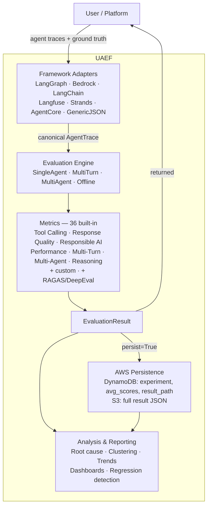

# UAEF

**Universal Agent Evaluation Framework** — a framework-agnostic evaluation system for AI
agents. Plug it into any agentic platform to measure agent quality across 36 built-in
metrics, persist results to AWS, and track performance over time.

UAEF works with LangGraph, LangChain, AWS Bedrock, Langfuse, Strands, AgentCore, or any
custom framework via adapters. One `evaluate()` call gives you scores across tool calling,
response quality, safety, performance, reasoning, and more.

```python
from uaef.api import evaluate

result = evaluate(trace=trace, ground_truth=ground_truth)

print(f"Score: {result.overall_score:.2f}")
print(f"Passed: {result.passed}")
```

[Install UAEF](Getting-Started/installation.md){ .md-button .md-button--primary }
[Run your first evaluation](Getting-Started/quickstart.md){ .md-button }

## Where to go

| I want to… | Go to |
|---|---|
| Install and run a first evaluation | [Installation](Getting-Started/installation.md) · [Quickstart](Getting-Started/quickstart.md) |
| Understand traces, dimensions, and modes | [Core Concepts](Getting-Started/core-concepts.md) |
| See every metric | [Metrics Catalog](Guides/metrics-catalog.md) |
| Connect my agent framework | [Adapters](Guides/adapters.md) |
| Batch, CI/CD gating, production monitoring | [Use Cases](Guides/use-cases.md) |
| Track experiments and catch regressions | [Experiments](Guides/experiments.md) |
| Write my own metric | [Custom Metrics](Guides/custom-metrics.md) |
| Look up a class or function | [API Reference](API-Reference/index.md) |
| Deploy the service to AWS | `uaef-service/README.md` |

## Architecture



See [Core Concepts](Getting-Started/core-concepts.md) for the canonical trace format,
the seven evaluation dimensions, and the evaluation modes.

## Metrics at a glance

36 built-in metrics across 7 dimensions, plus 2 opt-in use-case-specific metrics and 15
more via the RAGAS and DeepEval integrations.

| Dimension | Metrics |
|-----------|---------|
| Tool Calling | `tool_selection_accuracy`, `tool_sequence_correctness`, `parameter_quality`, `mcp_compliance` |
| Response Quality | `answer_relevance`, `completeness`, `hallucination_score`, `accuracy` |
| Responsible AI | `safety_score`, `bias_score`, `prompt_injection_detection`, `toxicity_score` |
| Performance | `latency_score`, `token_efficiency`, `cost_efficiency`, `throughput` |
| Multi-Turn | `context_retention`, `coherence`, `conversation_completeness`, `turn_efficiency`, `role_adherence`, `holistic_llm_judge`, `user_satisfaction`, `sentiment`, `agent_tone`, `naturalness`, `instruction_compliance`, `optimum_turns` |
| Multi-Agent | `agent_utilization`, `delegation_quality`, `workflow_completion`, `coordination_efficiency` |
| Reasoning | `chain_of_thought_coherence`, `logical_consistency`, `reasoning_step_correctness`, `fallacy_detection` |

Run a subset by name:

```python
result = evaluate(trace=trace, metrics=["answer_relevance", "safety_score", "latency_score"])
```

Full tables, including the integration metrics and Stickler:
[Metrics Catalog](Guides/metrics-catalog.md).

## Tenant isolation

UAEF is a reference architecture designed to run **embedded inside a platform that
provides user/tenant isolation**. Direct deployment in a multi-tenant environment without
a host platform enforcing tenant isolation is not supported. Read
`SECURITY.md` for the full model.

## License

Apache License 2.0.
